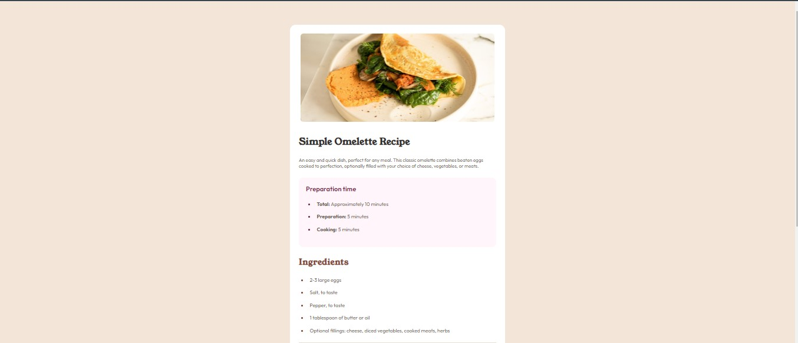

# Frontend Mentor - Recipe page solution

This is a solution to the [Recipe page challenge on Frontend Mentor](https://www.frontendmentor.io/challenges/recipe-page-KiTsR8QQKm).

 Frontend Mentor challenges help you improve your coding skills by building realistic projects. 

### Screenshot

### Links

- Solution URL: [Solution Code](https://github.com/MeherabSamir/Recipe-Page)
- Live Site URL: [Solution Live URL](https://recipepage-frontend-mentor.netlify.app/)

### Built with

- HTML5
- CSS 
- Flexbox
- Mobile-first workflow

### What I learned

I am trying to brush up HTML & CSS. Solving this problem is a part of it.

## Author

- Github - [Meherab Samir](https://github.com/MeherabSamir)
- Frontend Mentor - [@MeherabSamir](https://www.frontendmentor.io/profile/MeherabSamir)
- Twitter - [@MeherabSamir](https://www.twitter.com/MeherabSamir)
- Facebook - [Meherab Samir](https://facebook.com/meherabsamir.me)
- Instagram - [@meherab_samir](https://instagram.com/meherab_samir)
